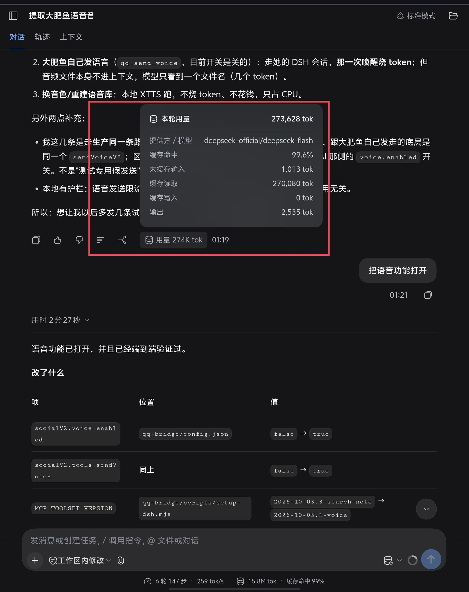
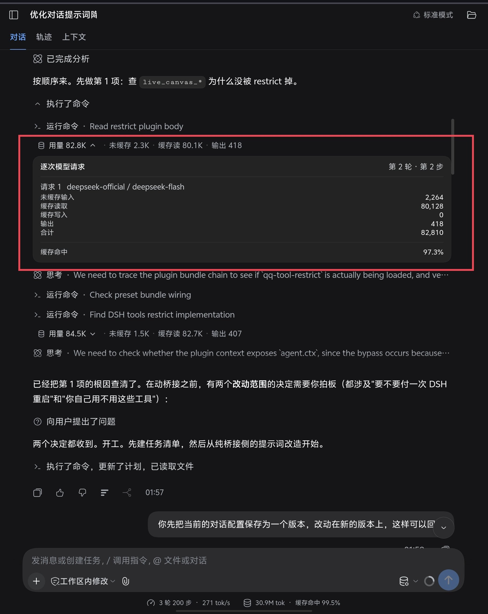

# dsh-step-token-usage

[](./LICENSE)
[](https://github.com/topics/dsh-plugin)
[](#compatibility)

An always-visible token pill on **every** assistant reply in the DeepSeek Harness (DSH) Web GUI, expanding into that step's exact per-request ledger — retries included. **No shipped package is patched.**

> 中文说明见 [README.md](README.md)。

---

## The problem

With **Settings → Performance & usage** set to *detailed*, DSH shows exactly one usage pill, at the **end of each turn**, and it stays hover-revealed. The dozens of intermediate tool-calling requests inside a turn are invisible.

That is where the cost actually lives. In one measured session:

| Turn | Requests | Uncached input | Cache read | Output | Total |
|---|---|---|---|---|---|
| 1 | 38 | 59,254 | 1,815,936 | 6,995 | **1,882,185** |
| 2 | 14 | 13,817 | 980,864 | 2,947 | **997,628** |

38 requests and ~1.9M tokens in a single turn — real, because every tool call resends the context. The turn-end pill alone never tells you that. This plugin pushes the accounting down to **each assistant step**.

## Features

- 📌 **Always visible** — one pill per assistant reply, no hovering
- 🧮 **Per reply** — uncached input, cache read, output for that request
- 🔍 **Click to expand** — provider/model, uncached input, cache read, cache write, output (with reasoning), total, cache-hit ratio
- 🔁 **Retries shown** — each `llm/retry` gets its own row with its failure code and message
- 🚫 **Missing data is marked, never zeroed** — omitted provider fields read *not reported*, and the total says where it came from
- 🌐 **Chinese + English**, following the DSH locale
- 🧩 **Non-conflicting** — the session-level pills and the shipped turn summary stay exactly as they were

## Screenshots

Both from real sessions (DSH 0.1.7-rc.2, dark theme), showing the **two granularities side by side**. This plugin does **not** replace the shipped view — they coexist.

**Shipped view (turn level)**: one pill at the end of a turn, whose dialog covers the **whole turn** — 273,628 tok here. Which of the hundred-odd requests inside it cost what is not visible.



**Added by this plugin (step level)**: every assistant reply carries an always-visible pill, expanding into that step's per-request ledger. Below, turn 2 step 2 totals 82,810 tok = uncached input 2,264 + cache read 80,128 + cache write 0 + output 418. The very next step in the same turn (84.5K) gets its own row.



> In the expanded panel `2,264 + 80,128 + 0 + 418 = 82,810` — the invariant `scripts/verify.mjs` asserts, visible on screen.

## Install

```bash
# from GitHub
dsh plugin --profile web add github:hana647929196/dsh-step-token-usage

# pinned to a release tag (recommended)
dsh plugin --profile web add github:hana647929196/dsh-step-token-usage#v1.1.0
```

Then **refresh the page**; restart `dsh web` if it does not take.

> This is a **plain-JavaScript client plugin with no build step**, so `pnpm run dev:web` is not needed. On the author's machine it took effect live, without even a page refresh.

From source:

```bash
npm pack
dsh plugin --profile web add dsh-step-token-usage-1.0.0.tgz
```

Manual install (no pnpm): copy the package to `~/.dsh/profiles/web/node_modules/dsh-step-token-usage`, append `"dsh-step-token-usage"` to `dsh.profile.bundles` in the profile `package.json`, and add this to the profile `cordis.patch.yml`:

```yaml
- insert:
    - id: step-token-usage
      name: 'dsh-step-token-usage'
```

## Usage

No configuration. Each assistant reply gains a strip above it:

```
🗄 Usage 27.4K  ▾   · uncached 26.1K · cache read 1.2K · output 174
```

Clicking it expands that step's ledger:

```
Per-request detail                              Turn 3 · Step 59
───────────────────────────────────────────────────────────────
Retry 1/5   deepseek-official   TRANSPORT
  DeepSeek Messages transport failed
  Usage was not reported for this request
───────────────────────────────────────────────────────────────
Request 1   deepseek-official / deepseek-flash
  Uncached input                                       1,354
  Cache read                                         167,808
  Cache write                                              0
  Output                                                 330
  Total                                              169,492
```

Intermediate (tool-calling) steps fold into the turn's **work process** group together with their text, matching the shipped folding behaviour — expand that group to see each step's pill. The final answer step's pill is always directly visible.

## Data provenance

Everything comes from the `data.usage` the provider already reported on each durable `assistant/message` event. Nothing is estimated or extrapolated.

- One step is normally one billed request: across 7033 measured steps, no step ever carried more than one `assistant/message`.
- The total prefers the provider's own `totalTokens`; it is summed from the buckets only when that field is absent, and the UI then says so.
- `total = uncached input + cache read + cache write + output` held in **every** stored sample on the author's machine (7040 / 7040 when written).
- *Uncached input* is `inputTokens` and excludes the cached part.

## Two design decisions worth knowing

**The pill sits above the reply text, and `anchorSeq` cannot be nudged.** It must equal the settled `assistant/message` sequence exactly. Slightly smaller and the engine folds the node into the turn's collapsed work-process group — hiding the pill on the final answer, which defeats the whole point. Slightly larger and the shipped turn tail treats it as later transcript (`hasLaterChatNode`) and **disables its branch/fork action**. Equality threads both; ordering then falls to the engine's context-key comparison, which places the pill before the assistant row.

**Missing data is marked, not zeroed.** Only absent `input`/`output` raise a warning; absent `cacheRead`/`cacheWrite` get a neutral note; absent `reasoningTokens` is ignored entirely — providers essentially never break it out, so counting it as missing would warn on every single row and drown the real signal.

## Compatibility

- Measured on **DSH 0.1.7-rc.2**.
- Uses two documented extension points only: `ctx.uiConversation.events.register()` for the node Definition, and the keyed `conversation.chat.node` slot for its renderer (whose contract states *"a kind with no occupant renders no row"* — adding a kind cannot collide with the shipped UI).
- Imports **no DSH client package**; only `react` from the browser module table, so shipped-package upgrades cannot break it via import paths.
- Styles use only `--dsw-alias-*` / `--dsh-*` theme tokens, all with fallbacks, and adapt to light and dark.
- **Upgrade note**: if a future DSH changes the work-process folding or the turn-tail branch rules, re-check the pill's placement. `scripts/verify.mjs` asserts the `anchorSeq` rule, so one run surfaces it.

## Troubleshooting

| Symptom | Cause / fix |
|---|---|
| No pills at all | Check the plugin mounted: `step-usage` should appear among the occupants of `conversation.chat.node`. Refresh, then restart `dsh web`. |
| Only the newest turn has pills | Earlier turns are not in the loaded window yet — scroll up to page them in. |
| A reply says *usage not reported* | That step genuinely has no provider usage (interrupted or failed request). Reported as-is. |
| Intermediate steps show no pill | They are folded into the turn's work-process group along with their text. Expand it. |
| After installing, the shipped turn-tail buttons need hovering | Known cosmetic side effect; it settles after a page refresh. **The branch/fork action is unaffected.** |

## How it works

**Host half (`lib/index.js`)** is an empty `apply()`. The feature is pure client presentation — no route, service, projection, or configuration — so this half exists only to make the package a mountable DSH plugin.

**Client half (`lib/client.js`)** registers a lazy factory via `window.__ModuleLoader__.load` (React from the browser module table; no JSX, no build). Its `apply`:

1. registers the zh/en dictionaries on `ctx.locale`;
2. registers a Definition of kind `step-usage` via `ctx.uiConversation.events.register()`, matching `step/start`, `assistant/message` (append) and `llm/retry`, keyed by `${turn}:${step}`;
3. registers the renderer cell under the same string in the keyed `conversation.chat.node` slot.

The Definition's state holds only `turn`/`step` identity; the whole ledger is folded from `context.matches` at materialization time, so it stays correct even when the loaded window begins mid-step with no `step/start`.

## Development & verification

```bash
npm run verify
# equivalent when npm is unavailable:
node scripts/verify.mjs
DSH_HOME=/path/to/dsh_home node scripts/verify.mjs
```

The script mounts the Client half against a fake module loader and Cordis context, then drives the Definition over every session log on the machine, asserting the properties that are hard to eyeball: agreeing registration kinds, matching locale key sets, the exact `anchorSeq`, self-consistent usage samples, and omitted buckets staying `null` rather than becoming `0`.

Author's machine (49 sessions) — a snapshot; the counts keep growing with use:

```
steps 7048 | materialized 7043 | withUsage 7040 | withoutUsage 3
requests 7042 | retries 6
missingCore 0 | missingOptional 11
invariantOk 7040 | invariantBad 0 | anchorBad 0
OK — no invariant broken.
```

## License

[MIT](./LICENSE)
